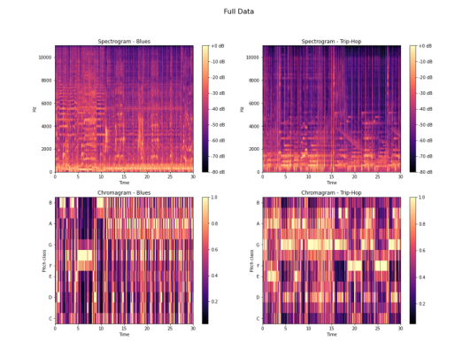
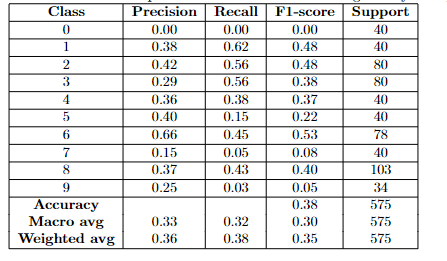

# Introduction
The purpose of this project is the genre classification from the spectrograms
of music pieces. The datasets given are the Free Music Archive (FMA) genre with 3834 samples
separated to 20 classes (music genres). The samples are
essentially spectrograms, created by 30-second clips of the music pieces. The spectrograms will be
analyzed using BiLSTM Model.

# Example of a Spectogram

# Data loading and analysis
Before implementing any models, the data were preprocessed. More specifically,
some classes that were similar were combined to make the classification problem a bit easier.

# Music Genre recognition using BiLSTM model
In this section a bidirectional LSTM (Long short term memory) will be used to Classify music
tracks based on the Genre. A bidirectional LSTM is a type of neural network that can classify music
based on genre. It takes a sequence of audio features as input and outputs a predicted genre label.
The LSTM part of the network allows it to learn long-term dependencies in the data, while the
bidirectional aspect allows it to consider context from both the past and future. This makes it an
effective tool for music classification tasks.

Training a bidirectional long short-term memory (BiLSTM) model using beat-synced spectograms as
input involves using spectograms of audio data that have been synchronized to the beat of the music.
Using beat-synced spectograms as input allows the BiLSTM model to make use of the rhythmic
structure of the music, which can be an important feature for tasks such as music classification

# Some demo Results

